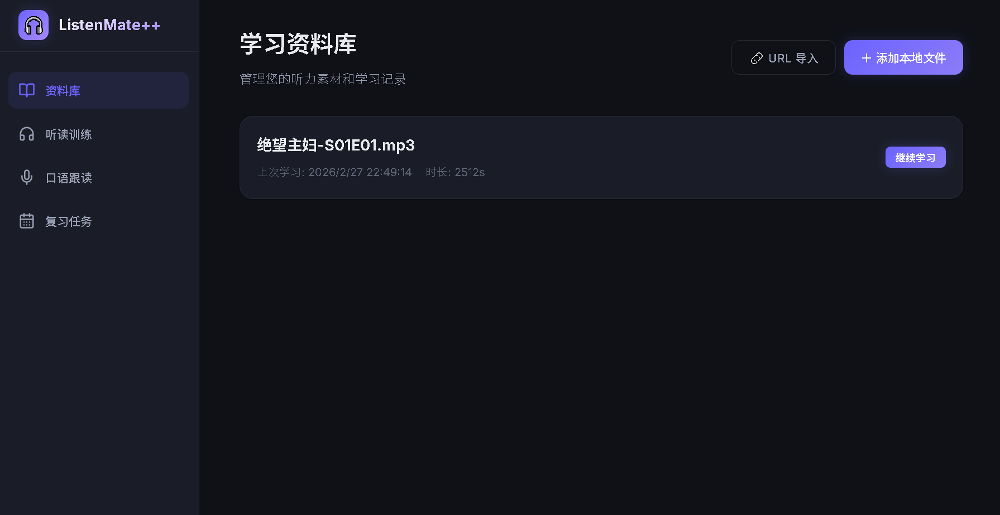
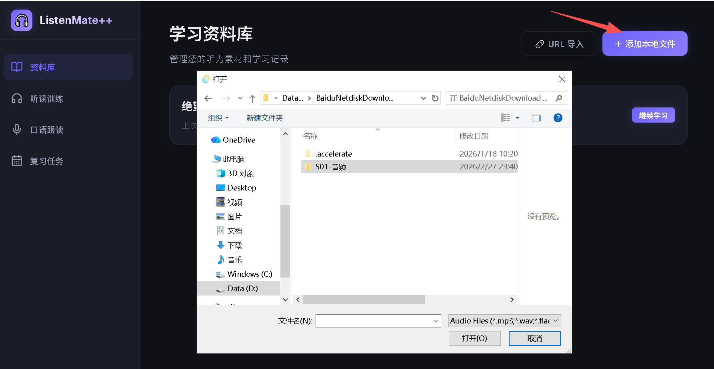
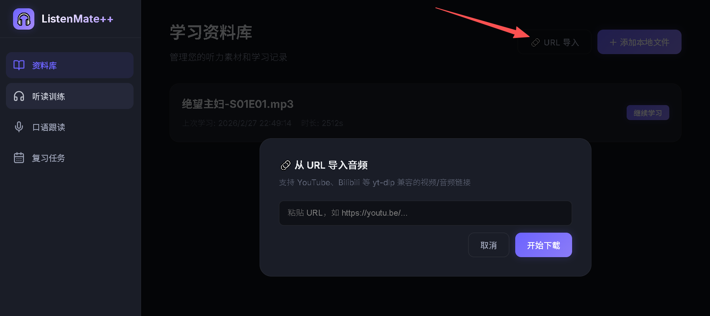
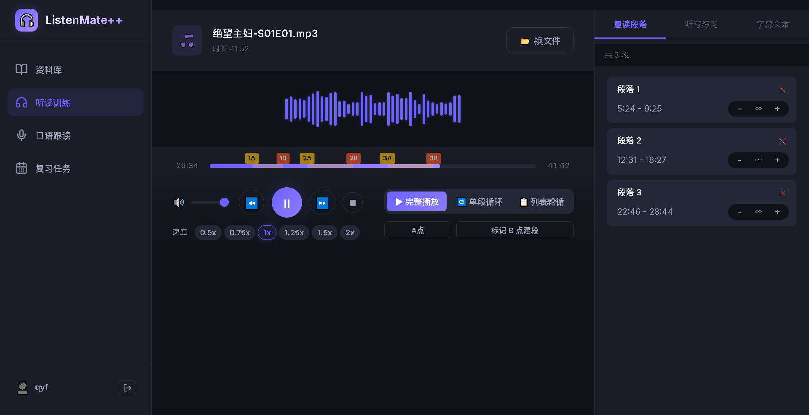
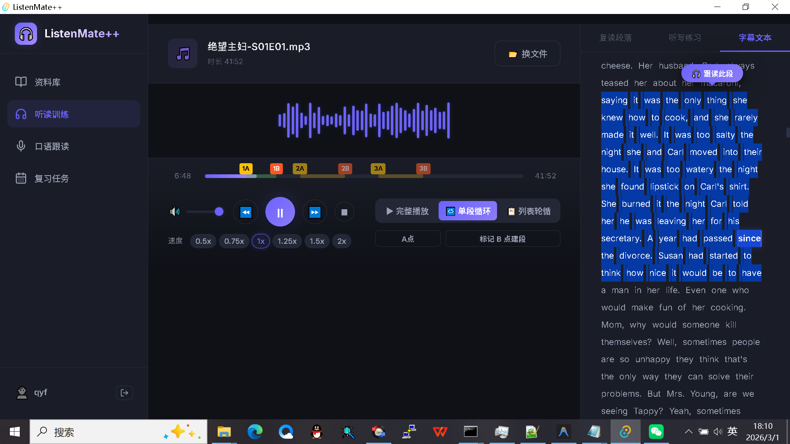
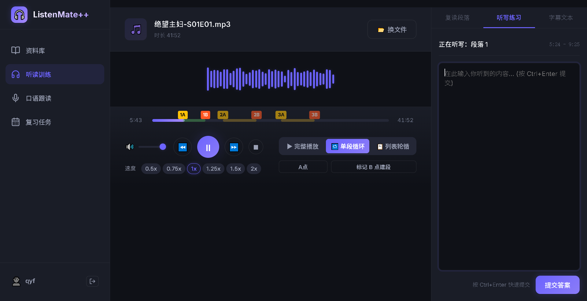
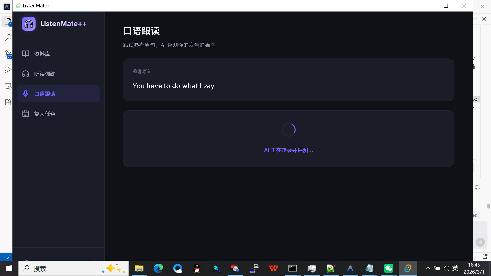

# Ting 使用说明书

欢迎使用 **Ting** —— 您的全方位语言学习助手。本程序集成了音频学习、听写练习、跟读训练及 AI 因素分析功能。

---

## 1. 登录与注册
首次启动程序，您需要创建一个学习账号，以便系统记录您的学习进度和听力曲线。

*   **创建账号**：在登录界面点击“注册”，输入用户名并设置密码。
*   **切换用户**：支持多用户使用，您可以在启动页选择不同的头像进入。

  

---

## 2. 资料库管理 (Library)
在开始学习前，您需要将学习资料导入程序。

### 导入本地文件
*   点击左侧导航栏的 **“资料库”**。
*   点击 **“添加资料”** 按钮，选择本地的 MP3 或 WAV 音频文件。
*   系统将自动提取音频信息并加入列表。

### URL 导入 (网页音频)
*   点击 **“URL 导入”**，输入支持的网页链接（如 YouTube/Podcast）。
*   程序将自动调用内置工具下载并转换音频。

``
   
---

## 3. 学习工作区 (Study Workspace)
这是您进行听力训练的核心区域。

*   **自动续播**：进入工作区时，系统会自动加载您上次没学完的资料，并恢复播放位置、播放速度及 AB 段设置。
*   **AB 段重复**：
    *   点击 **“添加 AB 段”** 标记当前听不准的区域。
    *   开启 **“循环”** 模式，针对性攻克难点。
*   **智能字幕/文本互动**：
    *   **点击即播**：在字幕区点击任意单词，播放器将立即跳转到该单词对应的起始时间点开始播放，方便快速重听。
    *   **划选跟读**：用鼠标选中字幕中的某段文字，系统将自动锁定该范围，点击“跟读”即可针对选定文本进行专项练习。

---

## 4. 听写练习 (Dictation)
在播放复读片段的过程中，您可以随时展开听写面板。

*   **实时听写**：边听边输入文字。
*   **智能评分**：点击提交后，系统会对比标准文本，计算您的准确率，并记录在学习曲线中。

---

## 5. 跟读与发音分析 (Speaking)
进阶阶段，您可以切换到 **“跟读模式”**。

*   **录音跟读**：点击录音按钮，模仿原声进行朗读。
*   **音素级分析**：录音完成后，点击“分析”。
*   **可视化反馈**：系统会通过 AI 将您的发音与标准音素进行对比，用红色/绿色标注读错或读准的音素，精准定位发音缺陷。

``

## 6. 常见问题排查
*   **黑屏/白屏**：请确保已安装最新的 WebView2 运行时。
*   **URL 下载失败**：请检查网络连接，且确保 `src-tauri/bin` 下存在 `yt-dlp` 执行文件。
*   **数据库重置**：如果由于特殊原因需要重置，可以删除 `AppData/Roaming/org.ting.app/db` 文件夹。

---

祝您在 **Ting** 的陪伴下，早日攻克语言障碍！
